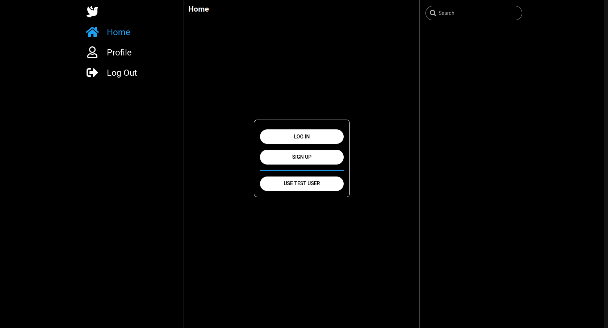
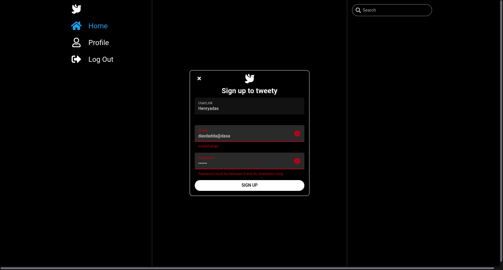
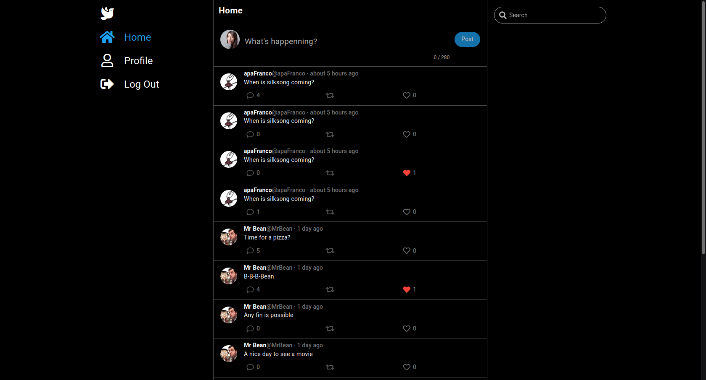
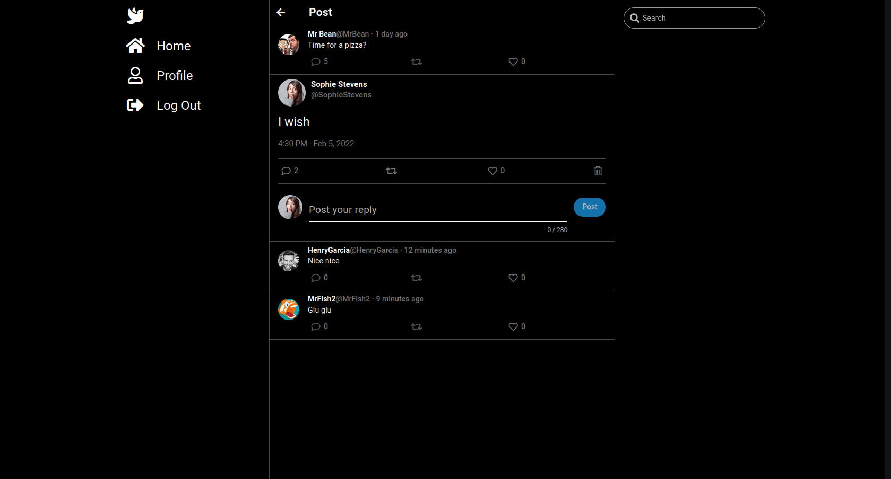
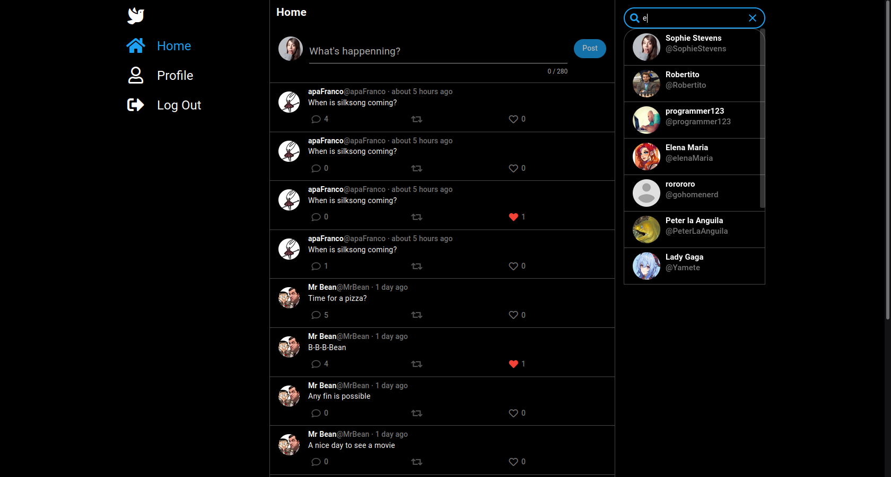
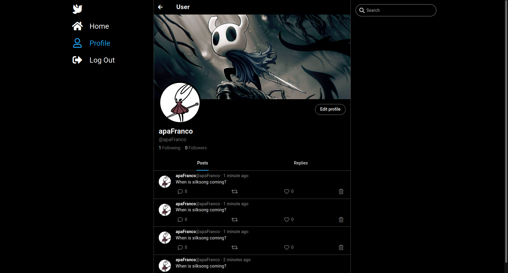

# tweety-frontend

Frontend for tweety

Simple Frontend created using quasar and vue to show case tweety API  

Temporally hosted at http://tweety-front-end.herokuapp.com
The hosted version only works on firefox because it lacks SSL certification to store HTTPOnly cookies


## Install the dependencies
```bash
yarn install
```

### Start the app in development mode (hot-code reloading, error reporting, etc.)
```bash
quasar dev
```

### Build the app for production
```bash
quasar build
```
## Auth


## SignUp


## Feed


## A post


## Search


## Profile


## Edit profile

